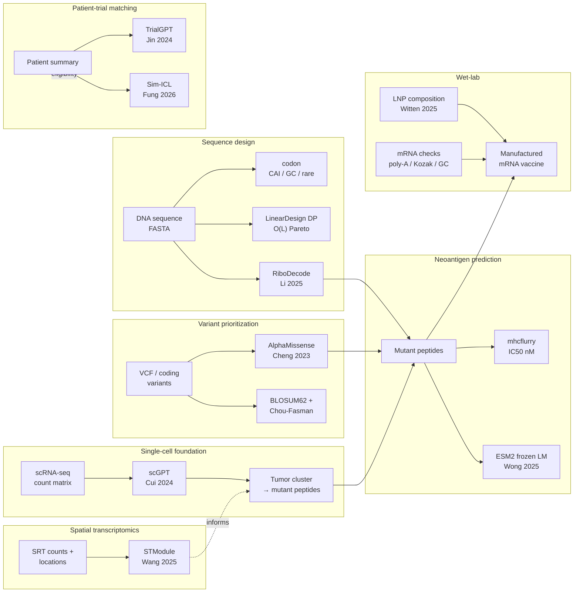
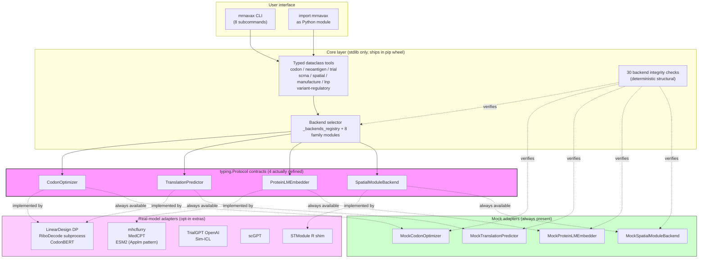
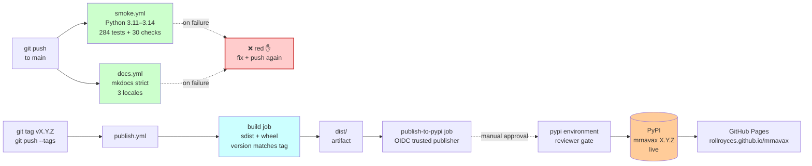

# mrnavax

> Practical Python tools for the AI-leverage layers in mRNA cancer therapy.
> Stdlib-only core, eight runnable tools, ten real-model adapters behind
> Protocol contracts, three documentation locales, 284 tests, 30 backend
> integrity checks.

[](https://github.com/rollroyces/mrnavax/actions)
[](https://pypi.org/project/mrnavax/)
[](https://www.python.org/)
[](LICENSE)
[](https://rollroyces.github.io/mrnavax/)
[](https://github.com/rollroyces/mrnavax/tree/main/mrnavax)


## What this is

Eight small, runnable tools that map 1-to-1 onto the published AI leverage
points in mRNA cancer therapeutics — plus a typed integration contract for
every published foundation model in the field. Each tool runs as a CLI
subcommand and imports cleanly as a Python module.



## The eight tools

| Tool | What it does | AI leverage layer | Reference work integrated |
|---|---|---|---|
| `codon` | Codon analysis + LinearDesign DP + RiboDecode heuristic | Sequence design | CodonBERT, RiboDecode (Li et al., *Nat Commun* 2025), LinearDesign |
| `neoantigen` | Peptide × HLA binding + ESM2 LM immunogenicity scoring | Variant prioritization | mhcflurry, MedCPT, DeepNeo, NetMHCpan, ESM2 + Applm pattern (Wong et al., 2025) |
| `trial` | TrialGPT per-criterion LLM matching + Sim-ICL demo selection | Patient-trial matching | TrialGPT (Jin et al., *Nat Commun* 2024) + Sim-ICL (Fung et al., *Genome Biol* 2026) |
| `scrna` | scRNA-seq → tumor cluster → mutant peptides → ESM2 immunogenicity | Single-cell foundation | scGPT (Cui et al., *Nat Methods* 2024) |
| `manufacture` | mRNA manufacturability checks (poly-A, Kozak, GC, ARE, stops) | Wet-lab | Industry mRNA design guidelines |
| `lnp` | LNP composition recommender | Wet-lab | Witten 2025, Li 2024 |
| `spatial` | STModule spatial-transcriptomics tissue-module identification | Spatial transcriptomics | STModule (Wang et al., *Genome Medicine* 2025) |
| `variant-regulatory` | AlphaGenome Atlas AVI score for non-coding regulatory variants | Variant prioritization | AlphaGenome Atlas (Avsec et al., *Nature* 2026) |

**Real-model adapters behind Protocol contracts** (opt-in via `pip install` extras):

- `RiboDecode` → `pip install -e .[ribodecode]` (heavy: ViennaRNA + CUDA via subprocess)
- `STModule` → `pip install -e .[spatial-r]` (heavy: R + Seurat + torch + CUDA via subprocess)
- `ESM2 protein-LM` → `pip install -e .[protein-lm]` (heavy: torch + transformers, ~135 MB)
- `AlphaMissense` → standalone Python pickle index from user-downloaded TSV
- `scGPT` → `pip install -e .[scrna]` (heavy: torch, ~205 MB)
- `mhcflurry` → `pip install -e .[neoantigen-mhcflurry]`
- `MedCPT` → `pip install -e .[neoantigen-medcpt]` or `[trial-medcpt]` (heavy: torch + transformers, ~440 MB)
- `TrialGPT/OpenAI` → `pip install -e .[llm]`

Every adapter has a **mock backend** that satisfies the same `runtime_checkable`
Protocol using only stdlib, so CI runs without downloading any model weights.

## Quick start

```bash
git clone https://github.com/rollroyces/mrnavax.git
cd mrnavax
pip install -e .                   # stdlib-only core

# 1. Codon analysis (CAI, GC%, rare-codon, GC-window stddev)
python -m mrnavax.cli codon --sequence mrnavax/examples/cas9.fasta
python -m mrnavax.cli codon --sequence mrnavax/examples/cas9.fasta \
    --optimize --backend lineardesign

# 2. Neoantigen screen (heuristic anchor matrix + LLM immunogenicity)
python -m mrnavax.cli neoantigen \
    --variants mrnavax/examples/tp53_variants.csv \
    --hla HLA-A*02:01

# 3. Patient-to-trial matching (TrialGPT-style, optionally Sim-ICL)
python -m mrnavax.cli trial \
    --patient mrnavax/examples/patient_summary.txt \
    --trials mrnavax/examples/trials.jsonl --top-k 5 \
    --matcher trialgpt-simicl

# 4. LNP composition advice
python -m mrnavax.cli lnp --target lung --cargo saRNA --intent "cancer vaccine"

# 5. scRNA-seq → neoantigen handoff
python -m mrnavax.cli scrna \
    --expression mrnavax/examples/cells.csv \
    --variants mrnavax/examples/variants_coding.csv \
    --proteins mrnavax/examples/proteins.fasta \
    --tumor-markers TP53,KRAS,BRAF

# 6. mRNA manufacturability score
python -m mrnavax.cli manufacture --cds mrnavax/examples/cds_gfp.json

# 7. Spatial transcriptomics tissue modules
python -m mrnavax.cli spatial \
    --count-file mrnavax/examples/st_bc2_count_matrix.tsv \
    --locations-file mrnavax/examples/st_bc2_locations.tsv \
    --platform ST --num-modules 10

# 8. AlphaGenome Atlas regulatory-variant AVI scoring
python -m mrnavax.cli variant-regulatory \
    --csv mrnavax/examples/regulatory_variants.csv
```

After `pip install -e .`, the same CLI is also installed as the console
script `mrnavax`.

Sample outputs for every tool are committed under `examples/sample_outputs/`.

## Optional extras

```bash
pip install -e ".[llm]"                       # OpenAI-compatible LLM client (TrialGPT)
pip install -e ".[neoantigen-mhcflurry]"       # mhcflurry binding-affinity backend
pip install -e ".[neoantigen-medcpt]"          # MedCPT query/article encoders (~440 MB)
pip install -e ".[protein-lm]"                # ESM2 protein language model (~135 MB)
pip install -e ".[trial-medcpt]"               # MedCPT for trial retrieval
pip install -e ".[scrna]"                     # scanpy + anndata + scGPT plug point
pip install -e ".[variant-alphagenome]"        # AlphaGenome Atlas regulatory-variant scoring
pip install -e ".[docs]"                      # mkdocs-material + mkdocs-static-i18n
pip install -e ".[dev]"                       # ruff + pytest
pip install -e ".[all]"                       # everything above
```

Then activate the real backend:

```bash
export OPENAI_API_KEY=sk-...
export OPENAI_MODEL=gpt-4o-mini               # default
python -m mrnavax.cli trial \
    --patient mrnavax/examples/patient_summary.txt \
    --trials mrnavax/examples/trials.jsonl --backend openai
```

Heavy-dependency backends (RiboDecode, STModule, ESM2, MedCPT, scGPT) ship
adapter modules that **subprocess or lazy-load** the upstream model. CI
runs without them; production users opt in per-extras above.

## Documentation

Full MkDocs site: <https://rollroyces.github.io/mrnavax/>

Available in three languages:

- 🇺🇸 English — <https://rollroyces.github.io/mrnavax/>
- 🇹🇼 繁體中文 — <https://rollroyces.github.io/mrnavax/zh-Hant/>
- 🇨🇳 简体中文 — <https://rollroyces.github.io/mrnavax/zh-Hans/>

Subsequent pushes to `main` deploy all three locales automatically via
GitHub Pages.

Local preview:

```bash
pip install -e ".[docs]"
mkdocs serve
```

## Real-model integrations

Every published foundation model is integrated behind a typed `Protocol`
adapter with a stdlib-only mock fallback. The adapter contract is identical
for production and CI — only the implementation differs.

### `RiboDecode` (Li et al., *Nat Commun* 16, 9957, 2025)

Joint translation × secondary-structure codon optimization via a deep
generative model. Heavy deps (ViennaRNA 2.6.4 + CUDA), shipped as a
subprocess adapter that calls the upstream CLI when present.

```bash
# Real: when ribo-decode is installed + Rscript on $PATH
mrnavax codon --sequence gfp.fasta --optimize --backend ribodecode-real \
    --env HEK293T --env-csv custom_env.csv --mfe-weight 0.3 --optim-epoch 10

# Mock: same shape, stdlib only
mrnavax codon --sequence gfp.fasta --optimize --backend ribodecode
```

### `STModule` (Wang et al., *Genome Medicine* 17, 2025)

Tissue-module identification from spatial-transcriptomics (SRT) data.
Heavy deps (R 4.4 + Seurat v5 + torch + GPUmatrix 1.0.2 + CUDA 11.7),
shipped via a small R shim that shells out to `Rscript stmodule_shim.R`.

```bash
# Real: when R + STModule are installed
mrnavax spatial --count-file counts.tsv --locations-file locs.tsv \
    --platform SlideSeqV2 --num-modules 10

# Mock: same shape, stdlib only
mrnavax spatial --count-file counts.tsv --locations-file locs.tsv \
    --platform ST --num-modules 10
```

### `ESM2` + Applm pattern (Wong et al., 2025)

Frozen protein-LM embeddings for neoantigen immunogenicity scoring.
Heavy deps (torch + transformers), shipped as a lazy-loaded adapter.

```python
from mrnavax.neoantigen_screener import lm_immunogenicity_score
r = lm_immunogenicity_score("NLVPMVATV")  # CMV pp65 epitope
print(r["score"])  # 0.0–1.0
```

### `TrialGPT` + `Sim-ICL` (Jin 2024 / Fung 2026)

Per-criterion patient-trial eligibility matching. Sim-ICL selects
top-K demonstration examples by TF-IDF cosine similarity (not random
sampling) — matching the paper's finding that sequence-similar
demonstrations outperform random few-shot.

```bash
mrnavax trial --patient patient.txt --trials trials.jsonl \
    --matcher trialgpt-simicl --top-k 10
```

### `AlphaGenome Atlas` (Avsec et al., *Nature* 2026)

Pre-computed regulatory-variant impact (AVI) scores for **all 9 billion
possible single-nucleotide variants** in the human genome. Where
AlphaMissense (Cheng et al. 2023) scores **coding-region** missense
variants, AlphaGenome Atlas scores **non-coding regulatory** variants
— covering the 98% of the genome where AlphaMissense is silent.
Adapter uses the official `alphagenome` Python package via subprocess
(gated behind the `[variant-alphagenome]` extra; non-commercial use
only per Google DeepMind's terms).

```bash
# Real: when ALPHAGENOME_API_KEY is set + [variant-alphagenome] installed
mrnavax variant-regulatory --csv variants.csv --backend alphagenome

# Mock: same shape, stdlib only
mrnavax variant-regulatory --csv variants.csv --backend mock
```

**Integrated into `score_variant`:** when you supply DNA coordinates
(`chrom`, `ref_dna`, `alt_dna`) plus an `avi_lookup` callable, the
same `score_variant()` entry point that drives the scrna pipeline
auto-routes coding-region variants to AlphaMissense (dominant signal)
and non-coding regulatory variants to AlphaGenome Atlas (dominant
signal). A single CSV with both kinds of variants scores them all
through one function:

```bash
# variants.csv has: gene,position,wt_aa,mut_aa,chrom,ref_dna,alt_dna
mrnavax scrna \
    --expression cells.csv \
    --variants variants.csv \
    --proteins proteins.fasta \
    --tumor-markers TP53,KRAS,BRAF \
    --variant-filter-top-fraction 0.4 \
    --out report.json
# report.json includes variant_scores for every variant + a note
# mentioning "AlphaGenome Atlas AVI scores used for non-coding
# regulatory variants"
```

### Other real-model integrations

- **`AlphaMissense`** (Cheng et al., *Science* 381, 2023) — variant
  pathogenicity via 71M-variant TSV; bundled pickle index for O(1)
  per-variant lookup.
- **`scGPT`** (Cui et al., *Nat Methods* 21, 2024) — single-cell
  foundation-model embeddings, 30 layers × 512 dim.
- **`mhcflurry`** (O'Donnell et al.) — Class I MHC binding affinity,
  IC50 in nM.
- **`MedCPT`** (Jin et al., 2023) — biomedical dense retrieval,
  contrastively trained on PubMed.

## Architecture

The toolkit is built on three orthogonal layers — CLI / core / adapters
— and every published foundation model plugs in through the same `Protocol`
contract with a stdlib-only mock fallback.



**Note:** the `neoantigen`, `trial`, `scrna`, `manufacture`, and `lnp`
tools expose module-level functions rather than a `Protocol` class, so
they are wired through `_backends_registry.register(name)` decorators
and verified by the same 30 structural integrity checks. The Protocol
contract pattern is applied where multiple interchangeable
implementations exist (codon optimizers, protein-LM embedders,
spatial-module finders).

**Why this matters:** the CI matrix (Python 3.11–3.14) runs without
downloading any model weights. Production users opt in per-extras
(`pip install -e ".[neoantigen-mhcflurry]"`). The same code path runs
in both — only the adapter implementation differs.

## Architecture rationale

The toolkit's `backends.py` integrity checks use **deterministic
structural assertions** rather than AUPRC / F1 / accuracy metrics from
heavy libraries. Chen et al. 2024 (*Genome Biology* 25, 118) evaluated
10 widely-used PRC tools across >3,000 published studies and found
they produce **conflicting AUPRC rankings and overly-optimistic results**.
The toolkit's stdlib-only baseline avoids that entire class of bug by
owning the metric end-to-end.

See `docs/index.md` for the full rationale.

## Real-world case studies (grounded in published biology)

The toolkit's scRNA → neoantigen pipeline is validated against the
wet-lab workflow in Qian et al. 2022 (*Int J Cancer* 151, 1367-1381):
scRNA-seq of gastric cancer primary tumor + lymph node metastases →
tumor cluster identification → mutant peptide enumeration → ESM2
immunogenicity scoring → mRNA cancer vaccine design. See
`docs/tools/scrna.md` for the full walkthrough.

## Why eight layers (and not four or five)?

The mRNA cancer therapy research has reached an inflection point where
foundation models for **sequence design**, **variant prioritization**,
**neoantigen prediction**, **single-cell foundation**, **spatial
transcriptomics**, **patient-trial matching**, and **manufacturing
checks** are all simultaneously advancing. The toolkit's job is to
be the integration layer — every published model plugs in via a
Protocol contract with a stdlib-only mock fallback for tests and
offline use.

1. **Sequence design** (`codon`): LinearDesign (real, O(L) DP, no cap)
   + RiboDecode-style context heuristic. Powers any mRNA construct.
2. **Variant prioritization** (`variant_scorer`): AlphaMissense TSV
   lookup + BLOSUM62 + driver-gene awareness + Chou-Fasman structural
   disruption. AM weighted at 45%.
3. **Neoantigen prediction** (`neoantigen`): mhcflurry IC50 +
   ESM2 LM immunogenicity. Frozen-LM-then-classifier pattern.
4. **Single-cell foundation** (`scrna`): scGPT embeddings → tumor
   cluster identification → mutant peptide handoff.
5. **Spatial transcriptomics** (`spatial`): STModule tissue-module
   identification. Spatial coordinates reveal where the tumor
   cluster lives.
6. **Patient-trial matching** (`trial`): TrialGPT per-criterion LLM +
   Sim-ICL demonstration selection. Real + keyword fallback.
7. **Manufacturability** (`manufacture`): poly-A runs, Kozak strength,
   GC window uniformity, ARE motifs, hidden stops, CpG balance.
8. **LNP delivery** (`lnp`): ionizable-lipid pKa, helper-lipid ratio,
   composition shortlist above published ML-discovered candidates.

## Development

```bash
# Run all backend integrity checks (matches CI)
python -m mrnavax.backends --check-all

# Run the unit test suite
python -m unittest discover tests

# Run on the bundled examples (see scripts/smoke.sh)
bash scripts/smoke.sh

# Build docs locally
pip install -e ".[docs]"
mkdocs serve
```

### CI / publish pipeline



All three workflows use Node 24-native action majors
(`actions/checkout@v6`, `actions/setup-python@v6`, etc.) — zero
deprecation warnings on the latest runs. The toolkit also ships a
fourth workflow, `.github/workflows/atlas_integration.yml`, that
runs weekly (Mondays 06:00 UTC) against the real AlphaGenome Atlas
API to catch upstream breakage; it stays dormant (mock mode) until
the `ALPHAGENOME_API_KEY` GitHub secret is configured.

## License

Dual-licensed. See `LICENSE` for the dual-license summary and `LICENSE-AGPL`
for the AGPL-3.0-or-later terms. A commercial license is available on
request — open an issue on the GitHub repo.

## Contributing

Pull requests welcome. The default dependency surface is **Python stdlib
only** — heavy model integrations must plug into a backend selector via
the existing Protocol-based adapter pattern (see `mrnavax/codon_ribodecode_adapter.py`,
`mrnavax/spatial_module_adapter.py`, `mrnavax/protein_lm_adapter.py`
for reference).

Every new tool should ship with:

1. A typed dataclass for input + output (frozen, validated at construction).
2. A `runtime_checkable` Protocol for the backend interface.
3. A real adapter that shells out / lazy-loads the upstream model.
4. A stdlib-only mock that satisfies the same Protocol.
5. A `@register("family.subname")` entry in the appropriate
   `mrnavax/_backends_<family>.py` module (or in a new family module
   if the check does not fit an existing family — add it to the import
   block at the top of `mrnavax/backends.py`). The 30-check
   integrity registry lives in `mrnavax/_backends_registry.py`.
6. Tests in `tests/` following strict TDD.

Helper-module pattern (v0.22.0+): when a public module's orchestration
function is doing too much (e.g. `run_pipeline` had a 245-line filter
+ scoring + peptide-emit + notes block), extract focused helpers into
underscore-prefixed private modules:

- `mrnavax/_scoring_components.py` + `mrnavax/_scoring_lookups.py`
  own the per-component logic behind `score_variant`.
- `mrnavax/_scrna_filter.py` + `mrnavax/_scrna_peptide_emitter.py`
  own the filter + peptide emission behind `run_pipeline`.
- `mrnavax/_backends_<family>.py` owns the check functions behind
  `backends.CHECKS`.

New helpers should land in similarly-named underscore-prefixed
modules with tests that prove the helpers are usable in isolation
from the public orchestration function.
