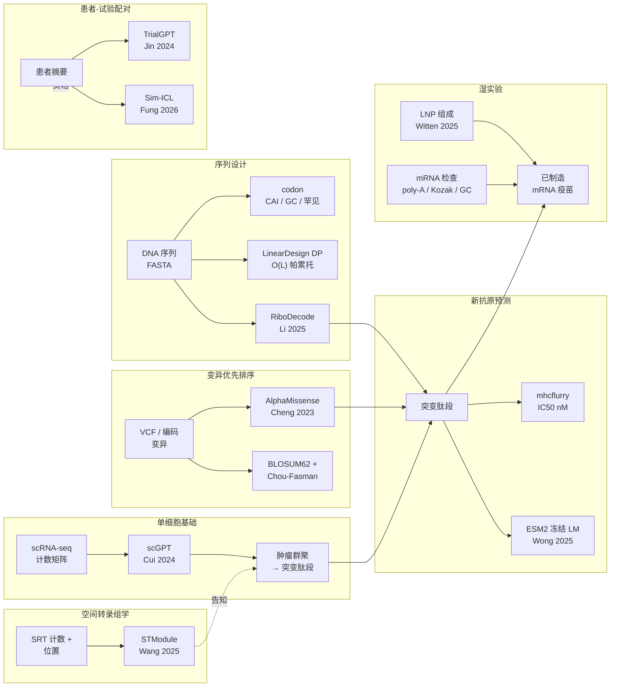

# mrnavax

> mRNA 癌症治疗中 AI 加杠杆层的实用 Python 工具。
> 纯标准库核心，八个可执行工具，九个真实模型适配器置于
> Protocol 契约之后，三份文档语种，249 个测试，30 项后端完整性检查。

[](https://github.com/rollroyces/mrnavax/actions)
[](https://pypi.org/project/mrnavax/)
[](https://www.python.org/)
[](LICENSE)
[](https://rollroyces.github.io/mrnavax/zh-Hans/)
[](https://github.com/rollroyces/mrnavax/tree/main/mrnavax)


## 这是什么

七个小巧、可执行的工具，一对一对应于 mRNA 癌症治疗中已发表的
AI 加杠杆点——加上每个已发表基础模型的类型化整合契约。每个工具可作为
CLI 子命令执行，也可干净地作为 Python 模块导入。



## 七个工具

| Tool | 工具功能 | AI 加杠杆层 | 整合的参考工作 |
|---|---|---|---|
| `codon` | 密码子分析 + LinearDesign DP + RiboDecode 启发式 | 序列设计 | CodonBERT、RiboDecode (Li et al., *Nat Commun* 2025)、LinearDesign |
| `neoantigen` | 肽段 × HLA 结合 + ESM2 LM 免疫原性评分 | 变异优先排序 | mhcflurry、MedCPT、DeepNeo、NetMHCpan、ESM2 + Applm 模式 (Wong et al., 2025) |
| `trial` | TrialGPT 每条标准 LLM 配对 + Sim-ICL 示范选择 | 患者-试验配对 | TrialGPT (Jin et al., *Nat Commun* 2024) + Sim-ICL (Fung et al., *Genome Biol* 2026) |
| `scrna` | scRNA-seq → 肿瘤群聚 → 突变肽段 → ESM2 免疫原性 | 单细胞基础 | scGPT (Cui et al., *Nat Methods* 2024) |
| `manufacture` | mRNA 可制造性检查（poly-A、Kozak、GC、ARE、终止密码子） | 湿实验 | 业界 mRNA 设计指南 |
| `lnp` | LNP 组成推荐 | 湿实验 | Witten 2025、Li 2024 |
| `spatial` | STModule 空间转录组学组织模块识别 | 空间转录组学 | STModule (Wang et al., *Genome Medicine* 2025) |
| `variant-regulatory` | AlphaGenome Atlas 非编码调控变异 AVI 评分 | 变异优先排序 | AlphaGenome Atlas (Avsec et al., *Nature* 2026) |

**Protocol 契约之后的真实模型适配器**（通过 `pip install` extras 可选安装）：

- `RiboDecode` → `pip install -e .[ribodecode]`（重：ViennaRNA + CUDA，通过 subprocess）
- `STModule` → `pip install -e .[spatial-r]`（重：R + Seurat + torch + CUDA，通过 subprocess）
- `ESM2 protein-LM` → `pip install -e .[protein-lm]`（重：torch + transformers，~135 MB）
- `AlphaMissense` → 独立 Python pickle 索引，源自用户下载的 TSV
- `scGPT` → `pip install -e .[scrna]`（重：torch，~205 MB）
- `mhcflurry` → `pip install -e .[neoantigen-mhcflurry]`
- `MedCPT` → `pip install -e .[neoantigen-medcpt]` 或 `[trial-medcpt]`（重：torch + transformers，~440 MB）
- `TrialGPT/OpenAI` → `pip install -e .[llm]`

每个适配器都有满足相同 `runtime_checkable` Protocol 的 **mock 后端**，
仅使用标准库，因此 CI 无需下载任何模型权重即可运行。

## 快速开始

```bash
git clone https://github.com/rollroyces/mrnavax.git
cd mrnavax
pip install -e .                   # 纯标准库核心

# 1. 密码子分析（CAI、GC%、罕见密码子、GC 窗口标准差）
python -m mrnavax.cli codon --sequence mrnavax/examples/cas9.fasta
python -m mrnavax.cli codon --sequence mrnavax/examples/cas9.fasta \
    --optimize --backend lineardesign

# 2. 新抗原筛选（启发式锚矩阵 + LLM 免疫原性）
python -m mrnavax.cli neoantigen \
    --variants mrnavax/examples/tp53_variants.csv \
    --hla HLA-A*02:01

# 3. 患者-试验配对（TrialGPT 风格，可选择 Sim-ICL）
python -m mrnavax.cli trial \
    --patient mrnavax/examples/patient_summary.txt \
    --trials mrnavax/examples/trials.jsonl --top-k 5 \
    --matcher trialgpt-simicl

# 4. LNP 组成建议
python -m mrnavax.cli lnp --target lung --cargo saRNA --intent "cancer vaccine"

# 5. scRNA-seq → 新抗原交接
python -m mrnavax.cli scrna \
    --expression mrnavax/examples/cells.csv \
    --variants mrnavax/examples/variants_coding.csv \
    --proteins mrnavax/examples/proteins.fasta \
    --tumor-markers TP53,KRAS,BRAF

# 6. mRNA 可制造性评分
python -m mrnavax.cli manufacture --cds mrnavax/examples/cds_gfp.json

# 7. 空间转录组学组织模块
python -m mrnavax.cli spatial \
    --count-file mrnavax/examples/st_bc2_count_matrix.tsv \
    --locations-file mrnavax/examples/st_bc2_locations.tsv \
    --platform ST --num-modules 10

# 8. AlphaGenome Atlas 非编码调控变异 AVI 评分
python -m mrnavax.cli variant-regulatory \
    --csv mrnavax/examples/regulatory_variants.csv
```

执行 `pip install -e .` 后，同样的 CLI 也会以 `mrnavax` 控制台脚本形式安装。

所有工具的示例输出皆提交于 `examples/sample_outputs/`。

## 可选扩展包

```bash
pip install -e ".[llm]"                       # OpenAI 兼容 LLM 客户端（TrialGPT）
pip install -e ".[neoantigen-mhcflurry]"       # mhcflurry 结合亲和力后端
pip install -e ".[neoantigen-medcpt]"          # MedCPT 查询/文章编码器（~440 MB）
pip install -e ".[protein-lm]"                # ESM2 蛋白质语言模型（~135 MB）
pip install -e ".[trial-medcpt]"               # 试验检索用的 MedCPT
pip install -e ".[scrna]"                     # scanpy + anndata + scGPT 接入点
pip install -e ".[docs]"                      # mkdocs-material + mkdocs-static-i18n
pip install -e ".[dev]"                       # ruff + pytest
pip install -e ".[all]"                       # 上述全部
```

接着启用真实后端：

```bash
export OPENAI_API_KEY=sk-...
export OPENAI_MODEL=gpt-4o-mini               # 默认
python -m mrnavax.cli trial \
    --patient mrnavax/examples/patient_summary.txt \
    --trials mrnavax/examples/trials.jsonl --backend openai
```

重型依赖后端（RiboDecode、STModule、ESM2、MedCPT、scGPT）会以
**subprocess 或延迟加载**方式接入上游模型。CI 在没有它们的情况下运行；
正式用户依需求通过上方 extras 安装。

## 文档

完整 MkDocs 站点：<https://rollroyces.github.io/mrnavax/>

提供三种语言版本：

- 🇺🇸 English — <https://rollroyces.github.io/mrnavax/>
- 🇹🇼 繁體中文 — <https://rollroyces.github.io/mrnavax/zh-Hant/>
- 🇨🇳 简体中文 — <https://rollroyces.github.io/mrnavax/zh-Hans/>

后续推送至 `main` 会通过 GitHub Pages 自动部署三种语种。

本地预览：

```bash
pip install -e ".[docs]"
mkdocs serve
```

## 真实模型集成

每个已发表的基础模型皆集成于具类型的 `Protocol` 适配器之后，并提供
仅使用标准库的 mock 后备。生产环境与 CI 的适配器契约完全相同——
仅实现不同。

### `RiboDecode`（Li et al., *Nat Commun* 16, 9957, 2025）

通过深度生成模型进行翻译 × 二级结构联合密码子优化。重型依赖
（ViennaRNA 2.6.4 + CUDA），以 subprocess 适配器形式封装，存在时调用
上游 CLI。

```bash
# 真实：已安装 ribo-decode + Rscript 在 $PATH
mrnavax codon --sequence gfp.fasta --optimize --backend ribodecode-real \
    --env HEK293T --env-csv custom_env.csv --mfe-weight 0.3 --optim-epoch 10

# Mock：相同形状，仅标准库
mrnavax codon --sequence gfp.fasta --optimize --backend ribodecode
```

### `STModule`（Wang et al., *Genome Medicine* 17, 2025）

从空间转录组学（SRT）数据识别组织模块。重型依赖
（R 4.4 + Seurat v5 + torch + GPUmatrix 1.0.2 + CUDA 11.7），以小型 R 壳层
（shim）调用 `Rscript stmodule_shim.R`。

```bash
# 真实：已安装 R + STModule
mrnavax spatial --count-file counts.tsv --locations-file locs.tsv \
    --platform SlideSeqV2 --num-modules 10

# Mock：相同形状，仅标准库
mrnavax spatial --count-file counts.tsv --locations-file locs.tsv \
    --platform ST --num-modules 10
```

### `ESM2` + Applm 模式（Wong et al., 2025）

冻结蛋白质语言模型嵌入，用于新抗原免疫原性评分。重型依赖
（torch + transformers），以延迟加载适配器形式封装。

```python
from mrnavax.neoantigen_screener import lm_immunogenicity_score
r = lm_immunogenicity_score("NLVPMVATV")  # CMV pp65 表位
print(r["score"])  # 0.0–1.0
```

### `TrialGPT` + `Sim-ICL`（Jin 2024 / Fung 2026）

每条标准的患者-试验资格配对。Sim-ICL 通过 TF-IDF 余弦相似度
（而非随机抽样）挑选 top-K 示范范例——对应论文发现：序列相似的
示范范例表现优于随机 few-shot。

```bash
mrnavax trial --patient patient.txt --trials trials.jsonl \
    --matcher trialgpt-simicl --top-k 10
```

### `AlphaGenome Atlas`（Avsec et al., *Nature* 2026）

预先计算的调控变异影响（AVI）评分，覆盖人类基因组中全部 **90 亿
个可能的单核苷酸变异**。AlphaMissense（Cheng et al. 2023）评分
**编码区** missense 变异；AlphaGenome Atlas 评分**非编码调控区**
变异——涵盖 AlphaMissense 沉默的 98% 基因组。适配器通过 subprocess
调用官方 `alphagenome` Python 软件包（受 `[variant-alphagenome]`
extra 保护；非商业用途依 Google DeepMind 条款）。

```bash
# 真实：已设置 ALPHAGENOME_API_KEY + 安装 [variant-alphagenome]
mrnavax variant-regulatory --csv variants.csv --backend alphagenome

# Mock：相同形状，仅标准库
mrnavax variant-regulatory --csv variants.csv --backend mock
```

**集成进 `score_variant`：** 当您提供 DNA 坐标（`chrom`、`ref_dna`、
`alt_dna`）与 `avi_lookup` 可调用对象时，驱动 scrna 管线的同一个
`score_variant()` 入口会自动将编码区变异路由到 AlphaMissense（主
导信号），将非编码调控区变异路由到 AlphaGenome Atlas（主导信号）。
单一 CSV 即可同时纳入两种变异并通过同一函数评分：

```bash
# variants.csv 含字段：gene,position,wt_aa,mut_aa,chrom,ref_dna,alt_dna
mrnavax scrna \
    --expression cells.csv \
    --variants variants.csv \
    --proteins proteins.fasta \
    --tumor-markers TP53,KRAS,BRAF \
    --variant-filter-top-fraction 0.4 \
    --out report.json
# report.json 包含每个变异的 variant_scores，以及备注提到
# 「AlphaGenome Atlas AVI scores used for non-coding regulatory variants」
```

### 其他真实模型集成

- **`AlphaMissense`**（Cheng et al., *Science* 381, 2023）——通过
  71M 变异 TSV 预测致变性；提供 pickle 索引以达 O(1) 查询。
- **`scGPT`**（Cui et al., *Nat Methods* 21, 2024）——单细胞基础模型
  嵌入，30 层 × 512 维。
- **`mhcflurry`**（O'Donnell et al.）——Class I MHC 结合亲和力，
  IC50 单位 nM。
- **`MedCPT`**（Jin et al., 2023）——生物医学密集检索，于 PubMed 上
  对比学习训练。

## 架构设计理由

本工具包的 `backends.py` 完整性检查使用**确定性的结构性断言**，
而非来自重型库的 AUPRC / F1 / 准确率指标。Chen et al. 2024
（*Genome Biology* 25, 118）在超过 3,000 项已发表研究中评估了 10 个
广泛使用的 PRC 工具，发现它们会产生**互相冲突的 AUPRC 排名与
过度乐观的结果**。本工具包的纯标准库基线通过端到端拥有指标，
避开了整个类别的 bug。

完整理由请见 `docs/index.md`。

## 真实生物学案例（根植于已发表研究）

本工具包的 scRNA → 新抗原流程已通过 Qian et al. 2022
（*Int J Cancer* 151, 1367-1381）的湿实验工作流验证：胃癌原发肿瘤
加淋巴结转移的 scRNA-seq → 肿瘤群聚识别 → 突变肽段列举 →
ESM2 免疫原性评分 → mRNA 癌症疫苗设计。完整演示请见
`docs/tools/scrna.md`。

## 为何是七层（而非四或五）？

mRNA 癌症治疗研究正处于一个转折点：**序列设计**、**变异优先排序**、
**新抗原预测**、**单细胞基础**、**空间转录组学**、**患者-试验配对**
与**制造性检查**等领域的础模型正同步推进。本工具包的角色即是
整合层——每个已发表模型皆通过 Protocol 契约与纯标准库 mock 后备
接入。

1. **序列设计**（`codon`）：LinearDesign（真实，O(L) DP，无长度上限）
   + RiboDecode 风格上下文启发式。支持任何 mRNA 构建。
2. **变异优先排序**（`variant_scorer`）：AlphaMissense TSV 查询 +
   BLOSUM62 + 驱动基因感知 + Chou-Fasman 结构破坏。AM 权重 45%。
3. **新抗原预测**（`neoantigen`）：mhcflurry IC50 + ESM2 LM 免疫原性。
   冻结 LM 后接分类器模式。
4. **单细胞基础**（`scrna`）：scGPT 嵌入 → 肿瘤群聚识别 → 突变肽段
   交接。
5. **空间转录组学**（`spatial`）：STModule 组织模块识别。空间坐标
   揭示肿瘤群聚所在位置。
6. **患者-试验配对**（`trial`）：TrialGPT 每条标准 LLM + Sim-ICL
   示范选择。真实 + 关键字后备。
7. **可制造性**（`manufacture`）：poly-A 连续、Kozak 强度、GC 窗口
   均匀性、ARE 模块、隐藏终止密码子、CpG 平衡。
8. **LNP 递送**（`lnp`）：可电离脂质 pKa、辅助脂质比例、发表之
   ML 发现候选之上的组成捷径。

## 开发

```bash
# 运行所有后端完整性检查（对应 CI）
python -m mrnavax.backends --check-all

# 运行单元测试套件
python -m unittest discover tests

# 在随附示例上运行（见 scripts/smoke.sh）
bash scripts/smoke.sh

# 本地构建文档
pip install -e ".[docs]"
mkdocs serve
```

## 许可

双重许可。双重许可摘要请见 `LICENSE`，AGPL-3.0-or-later 条款请见
`LICENSE-AGPL`。商业许可可通过 GitHub 仓库提出 issue 申请。

## 发布到 PyPI

本工具包通过 GitHub Actions OIDC 采用**信任发布（trusted publishing）**
——无需管理长效 PyPI token。工作流位于 `.github/workflows/publish.yml`。

### 一次性设置

1. 于 <https://pypi.org/manage/account/publishing/> 注册待处理信任发布者：
   - 所有者：`rollroyces`
   - 仓库：`mrnavax`
   - 工作流文件：`publish.yml`
   - 环境：`pypi`
2. 于 GitHub 仓库的 **Settings → Environments** 建立 `pypi` 环境
   ——部署前需要审核者批准（建议用于正式部署）。

### 发布流程

```bash
# 1. 在 mrnavax/__init__.py + pyproject.toml 调整版本号
# 2. 提交并标记
git commit -am "release: v0.14.0"
git tag v0.14.0
git push --follow-tags

# 3. CI 自动执行：
#    a. build job  → 构建 sdist + wheel，验证版本与标记相符
#    b. publish-to-pypi → 上传至 PyPI（人工批准 'pypi' 环境后）
```

PEP 740 证明由 `pypa/gh-action-pypi-publish@release/v1` 自动生成。

### 手动后备（未设置信任发布者时）

若尚未注册信任发布者，可改用长效 API token：

```bash
# 于 https://pypi.org/manage/account/token/ 生成 token
python -m pip install --upgrade build twine
python -m build --sdist --wheel
TWINE_USERNAME=__token__ TWINE_PASSWORD=pypi-... \
    python -m twine upload dist/mrnavax-*
```

你会需要 PyPI token——至 <https://pypi.org/manage/account/token/>
产生，并通过 `TWINE_PASSWORD` 传入（搭配 `TWINE_USERNAME=__token__`）
或保存于 `~/.pypirc`。

## 贡献指南

欢迎提交 Pull Request。默认依赖面为**纯 Python 标准库**——重型
模型集成必须通过现有的 Protocol 适配器模式接入后端选择器（参考
`mrnavax/codon_ribodecode_adapter.py`、
`mrnavax/spatial_module_adapter.py`、
`mrnavax/protein_lm_adapter.py`）。

每个新工具应随附：

1. 输入与输出的具类型 dataclass（frozen，于构造时验证）。
2. 后端接口的 `runtime_checkable` Protocol。
3. 通过 subprocess / 延迟加载接入上游模型的真实适配器。
4. 满足相同 Protocol 的纯标准库 mock。
5. `backends.py` 中的 `register()` 条目供 CI 完整性使用。
6. `tests/` 中遵循严格 TDD 的测试。
