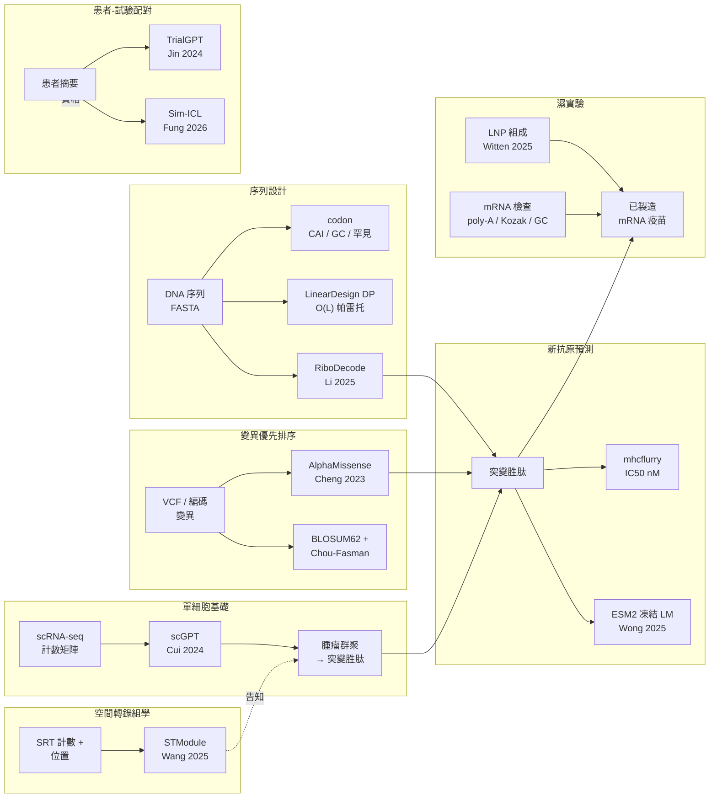

# mrnavax

> mRNA 癌症治療中 AI 加槓桿層的實用 Python 工具。
> 純標準函式庫核心，八個可執行工具，十個真實模型配接器置於
> Protocol 契約之後，三份文件語系，284 個測試，30 項後端完整性檢查。

[](https://github.com/rollroyces/mrnavax/actions)
[](https://pypi.org/project/mrnavax/)
[](https://www.python.org/)
[](LICENSE)
[](https://rollroyces.github.io/mrnavax/zh-Hant/)
[](https://github.com/rollroyces/mrnavax/tree/main/mrnavax)


## 這是什麼

八個小巧、可執行的工具，一對一對應於 mRNA 癌症治療中已發表的
AI 加槓桿點——加上每個已發表基礎模型的型別化整合契約。每個工具可作為
CLI 子指令執行，也可乾淨地作為 Python 模組匯入。



## 八個工具

| Tool | 工具功能 | AI 加槓桿層 | 整合的參考工作 |
|---|---|---|---|
| `codon` | 密碼子分析 + LinearDesign DP + RiboDecode 啟發式 | 序列設計 | CodonBERT、RiboDecode (Li et al., *Nat Commun* 2025)、LinearDesign |
| `neoantigen` | 胜肽 × HLA 結合 + ESM2 LM 免疫原性評分 | 變異優先排序 | mhcflurry、MedCPT、DeepNeo、NetMHCpan、ESM2 + Applm 模式 (Wong et al., 2025) |
| `trial` | TrialGPT 每條標準 LLM 配對 + Sim-ICL 示範選擇 | 患者-試驗配對 | TrialGPT (Jin et al., *Nat Commun* 2024) + Sim-ICL (Fung et al., *Genome Biol* 2026) |
| `scrna` | scRNA-seq → 腫瘤群聚 → 突變胜肽 → ESM2 免疫原性 | 單細胞基礎 | scGPT (Cui et al., *Nat Methods* 2024) |
| `manufacture` | mRNA 可製造性檢查（poly-A、Kozak、GC、ARE、終止密碼子） | 濕實驗 | 業界 mRNA 設計指引 |
| `lnp` | LNP 組成推薦 | 濕實驗 | Witten 2025、Li 2024 |
| `spatial` | STModule 空間轉錄組學組織模組識別 | 空間轉錄組學 | STModule (Wang et al., *Genome Medicine* 2025) |
| `variant-regulatory` | AlphaGenome Atlas 非編碼調控變異 AVI 評分 | 變異優先排序 | AlphaGenome Atlas (Avsec et al., *Nature* 2026) |

**Protocol 契約之後的真實模型配接器**（透過 `pip install` extras 選擇性安裝）：

- `RiboDecode` → `pip install -e .[ribodecode]`（重：ViennaRNA + CUDA，透過 subprocess）
- `STModule` → `pip install -e .[spatial-r]`（重：R + Seurat + torch + CUDA，透過 subprocess）
- `ESM2 protein-LM` → `pip install -e .[protein-lm]`（重：torch + transformers，~135 MB）
- `AlphaMissense` → 獨立 Python pickle 索引，源自使用者下載的 TSV
- `scGPT` → `pip install -e .[scrna]`（重：torch，~205 MB）
- `mhcflurry` → `pip install -e .[neoantigen-mhcflurry]`
- `MedCPT` → `pip install -e .[neoantigen-medcpt]` 或 `[trial-medcpt]`（重：torch + transformers，~440 MB）
- `TrialGPT/OpenAI` → `pip install -e .[llm]`

每個配接器都有滿足相同 `runtime_checkable` Protocol 的 **mock 後端**，
僅使用標準函式庫，因此 CI 無需下載任何模型權重即可執行。

## 快速開始

```bash
git clone https://github.com/rollroyces/mrnavax.git
cd mrnavax
pip install -e .                   # 純標準函式庫核心

# 1. 密碼子分析（CAI、GC%、罕見密碼子、GC 視窗標準差）
python -m mrnavax.cli codon --sequence mrnavax/examples/cas9.fasta
python -m mrnavax.cli codon --sequence mrnavax/examples/cas9.fasta \
    --optimize --backend lineardesign

# 2. 新抗原篩選（啟發式錨矩陣 + LLM 免疫原性）
python -m mrnavax.cli neoantigen \
    --variants mrnavax/examples/tp53_variants.csv \
    --hla HLA-A*02:01

# 3. 患者-試驗配對（TrialGPT 風格，可選擇 Sim-ICL）
python -m mrnavax.cli trial \
    --patient mrnavax/examples/patient_summary.txt \
    --trials mrnavax/examples/trials.jsonl --top-k 5 \
    --matcher trialgpt-simicl

# 4. LNP 組成建議
python -m mrnavax.cli lnp --target lung --cargo saRNA --intent "cancer vaccine"

# 5. scRNA-seq → 新抗原交接
python -m mrnavax.cli scrna \
    --expression mrnavax/examples/cells.csv \
    --variants mrnavax/examples/variants_coding.csv \
    --proteins mrnavax/examples/proteins.fasta \
    --tumor-markers TP53,KRAS,BRAF

# 6. mRNA 可製造性評分
python -m mrnavax.cli manufacture --cds mrnavax/examples/cds_gfp.json

# 7. 空間轉錄組學組織模組
python -m mrnavax.cli spatial \
    --count-file mrnavax/examples/st_bc2_count_matrix.tsv \
    --locations-file mrnavax/examples/st_bc2_locations.tsv \
    --platform ST --num-modules 10

# 8. AlphaGenome Atlas 非編碼調控變異 AVI 評分
python -m mrnavax.cli variant-regulatory \
    --csv mrnavax/examples/regulatory_variants.csv
```

執行 `pip install -e .` 後，同樣的 CLI 也會以 `mrnavax` 主控台腳本形式安裝。

所有工具的範例輸出皆提交於 `examples/sample_outputs/`。

## 選用擴充套件

```bash
pip install -e ".[llm]"                       # OpenAI 相容 LLM 客戶端（TrialGPT）
pip install -e ".[neoantigen-mhcflurry]"       # mhcflurry 結合親和力後端
pip install -e ".[neoantigen-medcpt]"          # MedCPT 查詢/文章編碼器（~440 MB）
pip install -e ".[protein-lm]"                # ESM2 蛋白質語言模型（~135 MB）
pip install -e ".[trial-medcpt]"               # 試驗檢索用的 MedCPT
pip install -e ".[scrna]"                     # scanpy + anndata + scGPT 接入點
pip install -e ".[docs]"                      # mkdocs-material + mkdocs-static-i18n
pip install -e ".[dev]"                       # ruff + pytest
pip install -e ".[all]"                       # 上述全部
```

接著啟用真實後端：

```bash
export OPENAI_API_KEY=sk-...
export OPENAI_MODEL=gpt-4o-mini               # 預設
python -m mrnavax.cli trial \
    --patient mrnavax/examples/patient_summary.txt \
    --trials mrnavax/examples/trials.jsonl --backend openai
```

重型依賴後端（RiboDecode、STModule、ESM2、MedCPT、scGPT）會以
**subprocess 或延遲載入**方式接入上游模型。CI 在沒有它們的情況下執行；
正式使用者依需求透過上方 extras 安裝。

## 文件

完整 MkDocs 站點：<https://rollroyces.github.io/mrnavax/>

提供三種語言版本：

- 🇺🇸 English — <https://rollroyces.github.io/mrnavax/>
- 🇹🇼 繁體中文 — <https://rollroyces.github.io/mrnavax/zh-Hant/>
- 🇨🇳 简体中文 — <https://rollroyces.github.io/mrnavax/zh-Hans/>

後續推送至 `main` 會透過 GitHub Pages 自動部署三種語系。

本機預覽：

```bash
pip install -e ".[docs]"
mkdocs serve
```

## 真實模型整合

每個已發表的基礎模型皆整合於具型別的 `Protocol` 配接器之後，並提供
僅使用標準函式庫的 mock 後備。生產環境與 CI 的配接器契約完全相同——
僅實作不同。

### `RiboDecode`（Li et al., *Nat Commun* 16, 9957, 2025）

透過深層生成模型進行翻譯 × 二級結構聯合密碼子最佳化。重型依賴
（ViennaRNA 2.6.4 + CUDA），以 subprocess 配接器形式封裝，存在時呼叫
上游 CLI。

```bash
# 真實：已安裝 ribo-decode + Rscript 在 $PATH
mrnavax codon --sequence gfp.fasta --optimize --backend ribodecode-real \
    --env HEK293T --env-csv custom_env.csv --mfe-weight 0.3 --optim-epoch 10

# Mock：相同形狀，僅標準函式庫
mrnavax codon --sequence gfp.fasta --optimize --backend ribodecode
```

### `STModule`（Wang et al., *Genome Medicine* 17, 2025）

從空間轉錄組學（SRT）資料識別組織模組。重型依賴
（R 4.4 + Seurat v5 + torch + GPUmatrix 1.0.2 + CUDA 11.7），以小型 R 殼層
（shim）呼叫 `Rscript stmodule_shim.R`。

```bash
# 真實：已安裝 R + STModule
mrnavax spatial --count-file counts.tsv --locations-file locs.tsv \
    --platform SlideSeqV2 --num-modules 10

# Mock：相同形狀，僅標準函式庫
mrnavax spatial --count-file counts.tsv --locations-file locs.tsv \
    --platform ST --num-modules 10
```

### `ESM2` + Applm 模式（Wong et al., 2025）

凍結蛋白質語言模型嵌入，用於新抗原免疫原性評分。重型依賴
（torch + transformers），以延遲載入配接器形式封裝。

```python
from mrnavax.neoantigen_screener import lm_immunogenicity_score
r = lm_immunogenicity_score("NLVPMVATV")  # CMV pp65 表位
print(r["score"])  # 0.0–1.0
```

### `TrialGPT` + `Sim-ICL`（Jin 2024 / Fung 2026）

每條標準的患者-試驗資格配對。Sim-ICL 透過 TF-IDF 餘弦相似度
（而非隨機抽樣）挑選 top-K 示範範例——對應論文發現：序列相似的
示範範例表現優於隨機 few-shot。

```bash
mrnavax trial --patient patient.txt --trials trials.jsonl \
    --matcher trialgpt-simicl --top-k 10
```

### `AlphaGenome Atlas`（Avsec et al., *Nature* 2026）

預先計算的調控變異影響（AVI）評分，覆蓋人類基因體中全部 **90 億
個可能的單核苷酸變異**。AlphaMissense（Cheng et al. 2023）評分
**編碼區** missense 變異；AlphaGenome Atlas 評分**非編碼調控區**
變異——涵蓋 AlphaMissense 沉默的 98% 基因體。配接器透過 subprocess
呼叫官方 `alphagenome` Python 套件（受 `[variant-alphagenome]`
extra 保護；非商業用途依 Google DeepMind 條款）。

```bash
# 真實：已設定 ALPHAGENOME_API_KEY + 安裝 [variant-alphagenome]
mrnavax variant-regulatory --csv variants.csv --backend alphagenome

# Mock：相同形狀，僅標準函式庫
mrnavax variant-regulatory --csv variants.csv --backend mock
```

**整合進 `score_variant`：** 當您提供 DNA 座標（`chrom`、`ref_dna`、
`alt_dna`）與 `avi_lookup` 可呼叫物件時，驅動 scrna 管線的同一個
`score_variant()` 入口會自動將編碼區變異路由到 AlphaMissense（主
導訊號），將非編碼調控區變異路由到 AlphaGenome Atlas（主導訊號）。
單一 CSV 即可同時納入兩種變異並透過同一函式評分：

```bash
# variants.csv 含欄位：gene,position,wt_aa,mut_aa,chrom,ref_dna,alt_dna
mrnavax scrna \
    --expression cells.csv \
    --variants variants.csv \
    --proteins proteins.fasta \
    --tumor-markers TP53,KRAS,BRAF \
    --variant-filter-top-fraction 0.4 \
    --out report.json
# report.json 包含每個變異的 variant_scores，以及備註提到
# 「AlphaGenome Atlas AVI scores used for non-coding regulatory variants」
```

### 其他真實模型整合

- **`AlphaMissense`**（Cheng et al., *Science* 381, 2023）——透過
  71M 變異 TSV 預測致變性；提供 pickle 索引以達 O(1) 查詢。
- **`scGPT`**（Cui et al., *Nat Methods* 21, 2024）——單細胞基礎模型
  嵌入，30 層 × 512 維。
- **`mhcflurry`**（O'Donnell et al.）——Class I MHC 結合親和力，
  IC50 單位 nM。
- **`MedCPT`**（Jin et al., 2023）——生物醫學密集檢索，於 PubMed 上
  對比學習訓練。

## 架構設計理由

本工具組的 `backends.py` 完整性檢查使用**確定性的結構性斷言**，
而非來自重型函式庫的 AUPRC / F1 / 準確率指標。Chen et al. 2024
（*Genome Biology* 25, 118）在超過 3,000 項已發表研究中評估了 10 個
廣泛使用的 PRC 工具，發現它們會產生**互相衝突的 AUPRC 排名與
過度樂觀的結果**。本工具組的純標準函式庫基線透過端到端擁有指標，
避開了整個類別的 bug。

完整理由請見 `docs/index.md`。

## 真實生物學案例（紮根於已發表研究）

本工具組的 scRNA → 新抗原流程已透過 Qian et al. 2022
（*Int J Cancer* 151, 1367-1381）的濕實驗工作流程驗證：胃癌原發腫瘤
加淋巴結轉移的 scRNA-seq → 腫瘤群聚識別 → 突變胜肽列舉 →
ESM2 免疫原性評分 → mRNA 癌症疫苗設計。完整示範請見
`docs/tools/scrna.md`。

## 為何是八層（而非四或五）？

mRNA 癌症治療研究正處於一個轉折點：**序列設計**、**變異優先排序**、
**新抗原預測**、**單細胞基礎**、**空間轉錄組學**、**患者-試驗配對**
與**製造性檢查**等領域的基礎模型正同步推進。本工具組的角色即是
整合層——每個已發表模型皆透過 Protocol 契約與純標準函式庫 mock 後備
接入。

1. **序列設計**（`codon`）：LinearDesign（真實，O(L) DP，無長度上限）
   + RiboDecode 風格上下文啟發式。支援任何 mRNA 建構。
2. **變異優先排序**（`variant_scorer`）：AlphaMissense TSV 查詢 +
   BLOSUM62 + 驅動基因感知 + Chou-Fasman 結構破壞。AM 權重 45%。
3. **新抗原預測**（`neoantigen`）：mhcflurry IC50 + ESM2 LM 免疫原性。
   凍結 LM 後接分類器模式。
4. **單細胞基礎**（`scrna`）：scGPT 嵌入 → 腫瘤群聚識別 → 突變胜肽
   交接。
5. **空間轉錄組學**（`spatial`）：STModule 組織模組識別。空間座標
   揭示腫瘤群聚所在位置。
6. **患者-試驗配對**（`trial`）：TrialGPT 每條標準 LLM + Sim-ICL
   示範選擇。真實 + 關鍵字後備。
7. **可製造性**（`manufacture`）：poly-A 連續、Kozak 強度、GC 視窗
   均勻性、ARE 模組、隱藏終止密碼子、CpG 平衡。
8. **LNP 傳遞**（`lnp`）：可電離脂質 pKa、輔助脂質比例、發表之
   ML 發現候選之上的組成捷選。

## 開發

```bash
# 執行所有後端完整性檢查（對應 CI）
python -m mrnavax.backends --check-all

# 執行單元測試套件
python -m unittest discover tests

# 在隨附範例上執行（見 scripts/smoke.sh）
bash scripts/smoke.sh

# 本機建構文件
pip install -e ".[docs]"
mkdocs serve
```

## 授權

雙重授權。雙重授權摘要請見 `LICENSE`，AGPL-3.0-or-later 條款請見
`LICENSE-AGPL`。商業授權可透過 GitHub 儲存庫提出 issue 申請。

## 發布至 PyPI

本工具組透過 GitHub Actions OIDC 採用**信任發布（trusted publishing）**
——無需管理長效 PyPI token。工作流程位於 `.github/workflows/publish.yml`。

### 一次性設定

1. 於 <https://pypi.org/manage/account/publishing/> 註冊待處理信任發布者：
   - 擁有者：`rollroyces`
   - 儲存庫：`mrnavax`
   - 工作流程檔案：`publish.yml`
   - 環境：`pypi`
2. 於 GitHub 儲存庫的 **Settings → Environments** 建立 `pypi` 環境
   ——部署前需要審核者核准（建議用於正式部署）。

### 發布流程

```bash
# 1. 在 mrnavax/__init__.py + pyproject.toml 調整版本號
# 2. 提交並標記
git commit -am "release: v0.14.0"
git tag v0.14.0
git push --follow-tags

# 3. CI 自動執行：
#    a. build job  → 建構 sdist + wheel，驗證版本與標記相符
#    b. publish-to-pypi → 上傳至 PyPI（人工核准 'pypi' 環境後）
```

PEP 740 證明由 `pypa/gh-action-pypi-publish@release/v1` 自動產生。

### 手動後備（未設定信任發布者時）

若尚未註冊信任發布者，可改用長效 API token：

```bash
# 於 https://pypi.org/manage/account/token/ 產生 token
python -m pip install --upgrade build twine
python -m build --sdist --wheel
TWINE_USERNAME=__token__ TWINE_PASSWORD=pypi-... \
    python -m twine upload dist/mrnavax-*
```

你會需要 PyPI token——至 <https://pypi.org/manage/account/token/>
產生，並透過 `TWINE_PASSWORD` 傳入（搭配 `TWINE_USERNAME=__token__`）
或儲存於 `~/.pypirc`。

## 貢獻指南

歡迎提交 Pull Request。預設依賴介面為**純 Python 標準函式庫**——重型
模型整合必須透過現有的 Protocol 配接器模式接入後端選擇器（參考
`mrnavax/codon_ribodecode_adapter.py`、
`mrnavax/spatial_module_adapter.py`、
`mrnavax/protein_lm_adapter.py`）。

每個新工具應隨附：

1. 輸入與輸出的具型別 dataclass（frozen，於建構時驗證）。
2. 後端介面的 `runtime_checkable` Protocol。
3. 透過 subprocess / 延遲載入接入上游模型的真實配接器。
4. 滿足相同 Protocol 的純標準函式庫 mock。
5. `backends.py` 中的 `register()` 條目供 CI 完整性使用。
6. `tests/` 中遵循嚴格 TDD 的測試。
